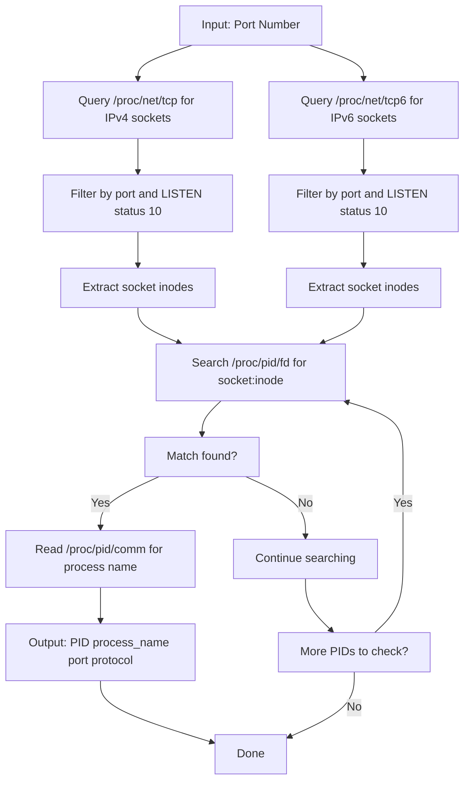

# wrun

**wrun** is a utility written in C to identify processes that are using a specific TCP port on Linux systems and, optionally, terminate those processes.

## Description

- Allows specifying a TCP port and displays the associated process.
- Offers an option to terminate the process listening on that port.
- Provides built-in help via standard options (`--help`, `--version`).

## Usage


Show help:

```sh
./wrun --help
```

Operate on a TCP port:

```sh
# Query the process using port 8080
./wrun -p 8080

# Terminate the process associated with the port
./wrun -k -p 8080

# Long form
./wrun --port=8080 --kill
```

> Note: The `-p/--port` parameter is required.

## How It Works: Process Discovery Flow



The algorithm uses Linux `/proc` filesystem to map sockets to processes through inode numbers.

## Requirements

- GCC compiler
- Valgrind
- Make utility
- Linux system

## Compile

### Using Makefile (Recommended)

```sh
cd wrun
make
```

This will compile the project and generate the `wrun` executable in the project root directory.

## Purpose

This project was developed with educational purposes as a learning exercise in:

- Linux command-line tool development using C
- Process and socket management through the /proc filesystem
- Memory management and dynamic data structures in C

## Acknowledgments

This project was developed with the assistance of **Big Pickle** (an AI model) through the **opencode** CLI tool, which helped with:
- Debugging and assistance with compilation issues.
- Documentation improvements and technical writing