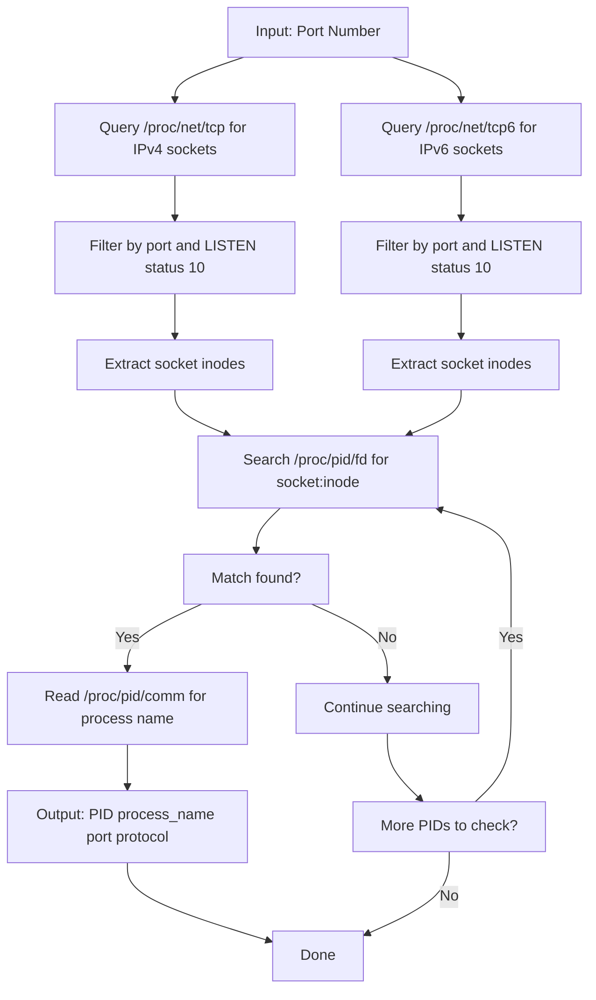

# wrun

**wrun** is a utility written in C to identify processes that are using a specific TCP port and, optionally, terminate those processes.

## Usage


Show help:

```sh
wrun --help
```

Operate on a TCP port:

```sh
# Query the process using port 8080
wrun -p 8080

# Terminate the process associated with the port
wrun -k -p 8080

```

> Note: The `-p/--port` parameter is required.

## How It Works: Process Discovery Flow


```mermaid
flowchart TD
    A[Input: Port Number] --> B[Query /proc/net/tcp for IPv4 sockets]
    A --> C[Query /proc/net/tcp6 for IPv6 sockets]
    
    B --> D[Filter by port and LISTEN status 10]
    C --> E[Filter by port and LISTEN status 10]
    
    D --> F[Extract socket inodes]
    E --> G[Extract socket inodes]
    
    F --> H[Search /proc/pid/fd for socket:inode]
    G --> H
    
    H --> I[Match found?]
    I -->|Yes| J[Read /proc/pid/comm for process name]
    I -->|No| K[Continue searching]
    
    J --> L[Output: PID process_name port protocol]
    K --> M[More PIDs to check?]
    M -->|Yes| H
    M -->|No| N[Done]
    
    L --> N
```

The algorithm uses Linux `/proc` filesystem to map sockets to processes through inode numbers.

## Requirements

- Any C compiler
- make utility
- Linux system

## Compile and Install

Compile:
```sh
cd wrun
make
```
Install:
```sh
make install

# Uninstall
make uninstall
```

## Purpose

This project was developed to:
- Learn C from scratch
- Learn how to use dynamic memory management in C
- Learn how processes work in Linux

## Contributing

Contributions are welcome. If you have a suggestion that would make this better, please fork the repo and create a pull request or you can also simply open an issue.